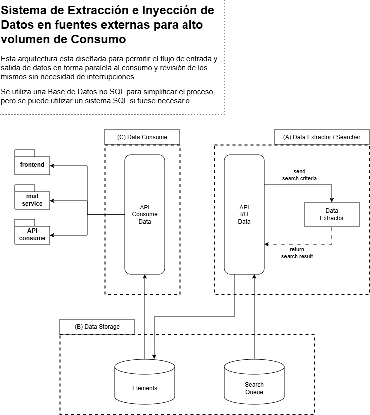

# Caso de Estudio: Arquitectura para Ingestión Masiva y Consumo Concurrente de Alta Disponibilidad

> **Estado:** Documento de Arquitectura de Referencia  
> **Autor:** Camilo A. F. S. Muñoz Montoya  
> **Licencia:** [Creative Commons CC BY-NC-ND 4.0](https://creativecommons.org/licenses/by-nc-nd/4.0/)  
> **Derechos de Autor:** © 2026 Camilo A. F. S. Muñoz Montoya . Todos los derechos reservados.

---

## Caso de Estudio y Aplicación

Este caso de estudio describe el diseño e implementación de una arquitectura distribuida y desacoplada orientada a la **ingestión, procesamiento y consumo masivo de datos heterogéneos en tiempo real**.

### El Desafío Técnico
En sistemas monolíticos o tradicionalmente acoplados, los procesos intensivos de extracción de datos (web scrapers, telemetría IoT, sensores, webhooks) compiten directamente por los recursos de cómputo, I/O y base de datos con las consultas de los usuarios finales. Esto genera bloqueos (*table/document locks*), altas latencias de respuesta y caídas de servicio durante picos de trabajo.

### Objetivos Principales de Diseño
* **Aislamiento de Cargas (Decoupling):** Separación total entre la canalización de ingesta/escritura y el motor de consumo/lectura.
* **Alta Disponibilidad (HA):** Tolerancia a fallos con un **SLA objetivo de 99.9%** mediante infraestructura redundante.
* **Escalabilidad Horizontal Independiente:** Capacidad de escalar los componentes de extracción o consumo por separado en función de la demanda.
* **Normalización de Datos:** Transformación de formatos heterogéneos de entrada a un modelo unificado de dominio antes de la persistencia.

---

## 2. Arquitectura del Sistema

El sistema se compone de tres subsistemas lógicos independientes aislados por contratos de API (REST/gRPC) y almacenamiento desacoplado:


<!-- 
```
┌──────────────────────────────────────┐     ┌──────────────────────────────────┐     ┌─────────────────────────────────────┐
│    (A) Data Extractor / Searcher     │     │        (B) Data Storage          │     │          (C) Data Consume           │
│                                      │     │                                  │     │                                     │
│  [ Sources / IoT / Scrapers ]        │     │  ┌────────────────────────────┐  │     │  [ Frontend / Apps ]                │
│               │                      │     │  │        Search Queue        │  │     │               ▲                     │
│               ▼                      │     │  └─────────────┬──────────────┘  │     │               │                     │
│       ┌───────────────┐              │     │                │                 │     │       ┌───────────────┐             │
│       │ API I/O Data  │──────────────┼────►│────────────────┘                 │     │       │  API Consume  │             │
│       └───────┬───────┘              │     │                ┌─────────────────┤     │       └───────┬───────┘             │
│               │                      │     │                │    Elements     │◄────┼───────────────┘                     │
│               ▼                      │     │                └─────────────────┘  │     │  [ Services / Mail / Consumers ]    │
│      ┌─────────────────┐             │     │                                  │     │                                     │
│      │ Data Extractor  │             │     └──────────────────────────────────┘     └─────────────────────────────────────┘
│      └─────────────────┘             │                                                                                     
└──────────────────────────────────────┘                                                                                     
``` -->

---

## 3. Componentes

### A: Módulo de Extracción y Sanitización (`Data Extractor / Searcher`)
* **Función:** Capturar, validar y sanitizar datos provenientes de fuentes externas no estructuradas o semi-estructuradas.
* **API I/O Data:** Actúa como orquestador de la ingesta. Se encarga de:
  1. Validar esquemas de datos entrantes (*Data Contract*).
  2. Aplicar reglas de sanitización e inyección de datos seguros.
  3. Registrar los trabajos pendientes y estados en la cola de búsqueda (`Search Queue`).
* **Data Extractor Workers:** Procesos asíncronos y desacoplados que ejecutan tareas de extracción específicas enviadas por la API y retornan los resultados procesados (`return search result`).

### B: Capa de Persistencia e Intercambio (`Data Storage`)
Aísla las operaciones de I/O mediante el uso de dos colecciones o almacenes diferenciados (implementados preferentemente sobre un motor **NoSQL** por su velocidad de escritura y flexibilidad de esquema):

1. **Collection: `Search Queue`**
   * Almacena metadatos de trabajos, estados de extracción (Pending, Processing, Completed, Failed) y criterios de búsqueda.
   * Sirve como búfer de control para evitar sobrecargar los extractores.
2. **Collection: `Elements`**
   * Contiene los datos procesados, sanitizados e indexados listos para ser entregados al consumidor final.

### C: Capa de Consumo de Alta Velocidad (`Data Consume API`)
* **Función:** Proporcionar lectura de datos de baja latencia hacia clientes finales.
* **Exposición:** Expone interfaces estandarizadas (REST / GraphQL) consumibles por cualquier cliente habilitado (*Web Frontends, Servicios de Notificaciones/Mail, Integraciones B2B*).
* **Ventaja:** Al leer exclusivamente de la colección `Elements` (o desde réplicas de lectura), el consumo no se ve afectado por la carga de procesamiento o escritura del Componente A.

---

## 4. Registros de Decisiones de Arquitectura (ADR)

### ADR-01: Selección de Persistencia NoSQL sobre RDBMS
* **Estatus:** Aprobado.
* **Contexto:** Las fuentes de ingesta (scrapers/IoT) producen esquemas cambiantes y alto volumen de escrituras simultáneas.
* **Decisión:** Adoptar un modelo NoSQL (ej. MongoDB, DocumentDB o DynamoDB).
* **Consecuencias:** Escrituras más rápidas, escalamiento horizontal nativo vía *Sharding* y eliminación de bloqueos de tabla.

### ADR-02: Empaquetamiento en Contenedores e Infraestructura Serverless
* **Estatus:** Aprobado.
* **Contexto:** Evitar costos fijos de servidor y permitir escalabilidad automática ante picos de demanda.
* **Decisión:** Encapsular las APIs (`API I/O Data` y `API Consume Data`) en imágenes **Docker** desplegables en servicios Serverless de Contenedores (ej. *Azure Container Apps, OCI Container Instances, AWS ECS Fargate*).
* **Consecuencias:** Escalado automático de 0 a $N$ instancias, portabilidad entre nubes y reducción de costos operativos.

---

## 5. Atributos de Calidad y Métricas de Rendimiento (KPIs)

| Atributo | Métrica Objetivo | Estrategia de Diseño |
| :--- | :--- | :--- |
| **Latencia de Lectura (P95)** | `< 150 ms` | Caché en API de Consumo + Réplicas de Lectura NoSQL |
| **Capacidad de Ingesta** | `+2,000 req/sec` | Procesamiento asíncrono con `Search Queue` |
| **Disponibilidad (SLA)** | `99.9%` | Despliegue Multi-AZ y réplicas con auto-failover |
| **Aislamiento de Carga** | `100%` | Separación física o lógica de endpoints de Ingesta y Consumo |

---

## 6. Guía de Despliegue (Infraestructura como Código)

La infraestructura esta pensada para ser un sistema de microservicios, serverless y con dependencias leves entre los servicios, esto es para poder actualizar y mantener cada servicio de forma independiente, en donde, las llamas a los servicios se realizan a travez de endpoints.

Esta arquitectura funciona ideamnete en servicios que permitan la independización de contenedores.
Esta diseñada para funcionar en entornos autogestionados, como servidores propios, VPS o sistemas como Azure, Oracle y similares en donde se puedan desplegar contenedores.

En cada llamada se agrega un **circuit-break** que impide el fallo global del modulo y permite aislar el problema. 

<!-- ### Estructura del Repositorio Recomendada
```text
.
├── README.md
├── docs/
│   └── architecture-diagram.png
└── terraform/
    ├── main.tf
    ├── variables.tf
    ├── outputs.tf
    └── modules/
        ├── container_apps/
        └── nosql_database/
```

### Comandos de Ejemplo
```bash
cd terraform/
terraform init
terraform plan
terraform apply
``` -->

---

## Licencia y Propiedad Intelectual

Este documento y los diseños adjuntos son propiedad intelectual de **Camilo A. F. S. Muñoz Montoya**.

* **Documentación y Diagramas:** Protegidos bajo la licencia [Creative Commons Attribution-NonCommercial-NoDerivatives 4.0 International (CC BY-NC-ND 4.0)](https://creativecommons.org/licenses/by-nc-nd/4.0/).
* **Código Fuente / Terraform (si aplica):** Licenciado bajo la Licencia MIT.
